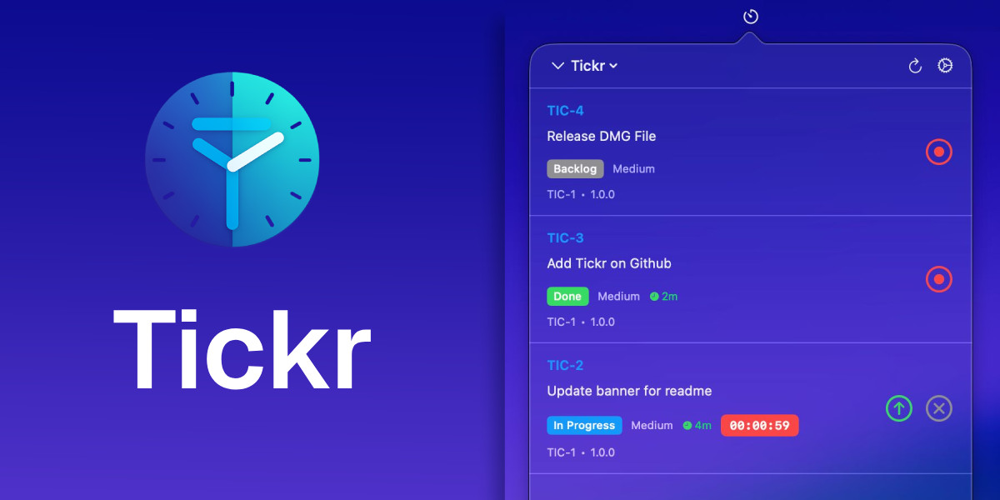

*A lightweight macOS menu bar application for tracking time on Jira issues.*

## Features

- **Menu Bar Integration**: Quick access from the macOS menu bar
- **Multiple Timers**: Track time on multiple issues simultaneously
- **Automatic Worklog Submission**: Automatically submits worklogs to Jira when stopping timers
- **Secure Storage**: API tokens stored securely in macOS Keychain
- **Real-time Display**: See logged time on issues instantly
- **Multiple Accounts**: Support for multiple Jira instances

## Requirements

- macOS 14.0+
- Xcode 15.0+
- Jira Cloud or Data Center account
- Jira API token or PAT Token for Data Center account

## Installation

1. Clone the repository
2. Open `Tickr.xcodeproj` in Xcode
3. Build and run

## Configuration

### Jira Cloud

1. Open Preferences (Tickr menu → Preferences)
2. Select **Cloud** as Account Type
3. Add your Jira account:
   - Account Name: A friendly name
   - Jira Base URL: Your Jira instance URL (e.g., `https://yourcompany.atlassian.net`)
   - Email: Your Jira account email
   - API Token: Generate one at [Atlassian API Tokens](https://id.atlassian.com/manage-profile/security/api-tokens)
4. Test the connection
5. Add the account

### Jira Data Center

1. Open Preferences (Tickr menu → Preferences)
2. Select **Data Center** as Account Type
3. Add your Jira account:
   - Account Name: A friendly name
   - Jira Base URL: Your Jira Data Center instance URL (e.g., `https://jira.yourcompany.com`)
   - Personal Access Token: Generate one in Jira Data Center (Profile → Personal Access Tokens)
4. **Important**: Enable Basic Authentication in Jira Data Center:
   - Go to Administration → General Configuration → Security
   - Enable "Allow basic authentication on API calls"
   - This is required for PAT authentication to work properly
5. Test the connection
6. Add the account

## Usage

1. Select your Jira account from the menu bar
2. Your assigned issues will appear
3. Click the record button to start tracking time
4. Click stop to submit the worklog to Jira
5. Or click cancel to discard the time

## Architecture

- **SwiftUI + SwiftData**: Modern Apple frameworks for UI and persistence
- **Keychain Services**: Secure token storage
- **Jira REST API**: Integration with Jira Cloud (v3) and Data Center (v2)
- **Combine**: Reactive timer updates
- **Actor-based Concurrency**: Safe API calls with Swift Concurrency

## License

MIT
